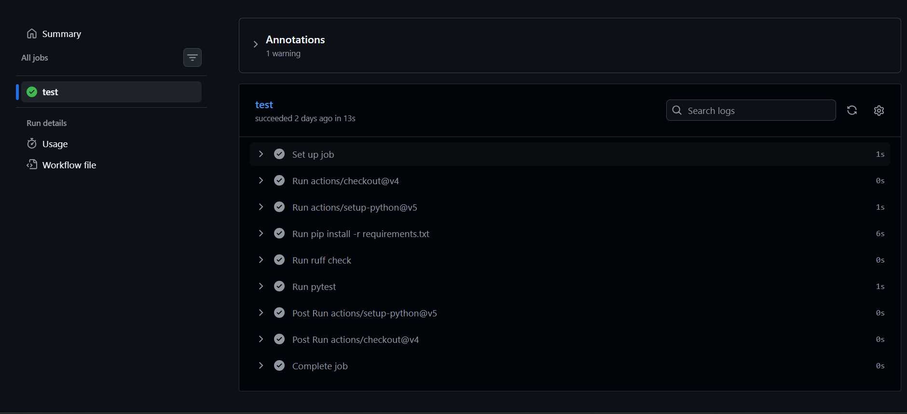
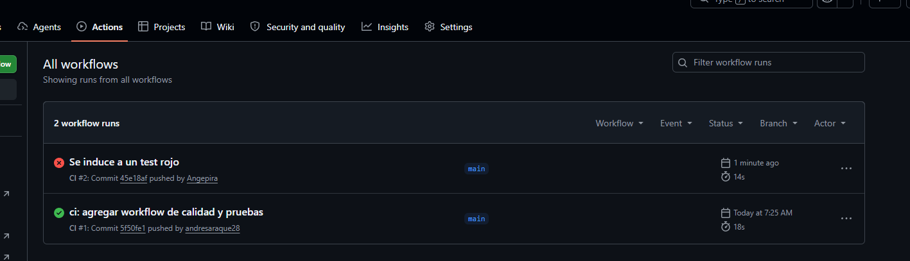
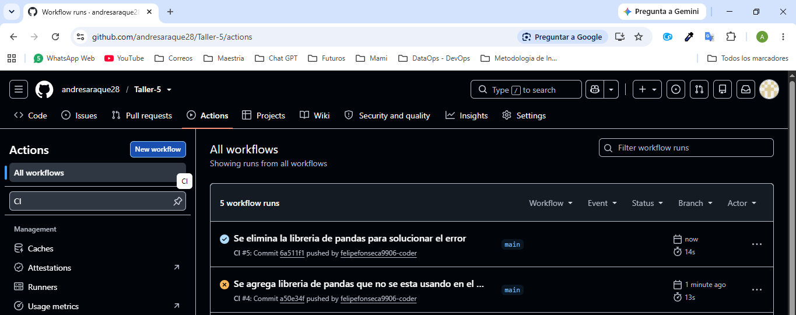

# Taller 5: Pipeline de CI para inventario

Este proyecto implementa y valida un módulo de reposición de inventario para una cadena
de tiendas. El pipeline de Integración Continua (CI) ejecuta automáticamente el análisis
de calidad y las pruebas cada vez que se realiza un `push` o se abre/actualiza un `pull_request`.

## Funcionalidad

El módulo [`src/inventario.py`](src/inventario.py) ofrece dos funciones:

- `dias_de_inventario(stock_actual, ventas_diarias)`: calcula cuántos días durará el
	inventario según el ritmo de ventas. Si no hay ventas, devuelve `-1.0` como señal de
	que el stock no se agota.
- `necesita_reposicion(stock_actual, ventas_diarias, umbral_dias=7)`: indica si el stock
	se agotará antes del umbral configurado.

El proyecto incluye cinco pruebas automatizadas en
[`tests/test_inventario.py`](tests/test_inventario.py), que validan los cálculos normales,
la ausencia de ventas, la decisión de reposición y el rechazo de stock negativo.

## Requisitos

- Python **3.12**
- `pip`
- Git

## Instalación y ejecución local

Desde la raíz del repositorio, crea y activa un entorno virtual:

```bash
python -m venv .venv
source .venv/bin/activate
```

En Windows PowerShell, activa el entorno con:

```powershell
.venv\Scripts\Activate.ps1
```

Instala las dependencias del proyecto:

```bash
pip install -r requirements.txt
```

Ejecuta el linter y las pruebas:

```bash
ruff check .
pytest
```

Resultado esperado:

```text
All checks passed!
5 passed
```

## Pipeline de GitHub Actions

El workflow está definido en [`.github/workflows/ci.yml`](.github/workflows/ci.yml), se
ejecuta sobre `ubuntu-latest` y utiliza Python 3.12. Sus pasos son:

1. **Checkout:** descarga el contenido del repositorio en el runner de GitHub Actions.
2. **Setup de Python:** instala y configura Python 3.12 para la ejecución del proyecto.
3. **Instalación de dependencias:** ejecuta `pip install -r requirements.txt`.
4. **Lint:** ejecuta `ruff check .` para detectar errores de estilo y código no utilizado.
5. **Pruebas:** ejecuta `pytest` y detiene el pipeline si alguna prueba falla.

Al ejecutarse en cada `push` y `pull_request`, el workflow evita que cambios con errores de
calidad o comportamiento pasen desapercibidos antes de integrarse en la rama principal.

## Evidencias del pipeline

### Ejecución exitosa

Todos los pasos del workflow finalizan correctamente y las cinco pruebas pasan.



### Ejecución fallida por una prueba

Se introdujo intencionalmente un cambio defectuoso para comprobar que `pytest` detecta un
error de comportamiento. Después de la verificación, el código fue corregido.



### Ejecución fallida por lint

Se agregó intencionalmente una dependencia no utilizada para comprobar que Ruff rechaza
el código con problemas de calidad. La dependencia fue eliminada posteriormente.



## Estructura del proyecto

```text
.
├── .github/workflows/ci.yml
├── src/
│   └── inventario.py
├── tests/
│   └── test_inventario.py
├── requirements.txt
└── README.md
```